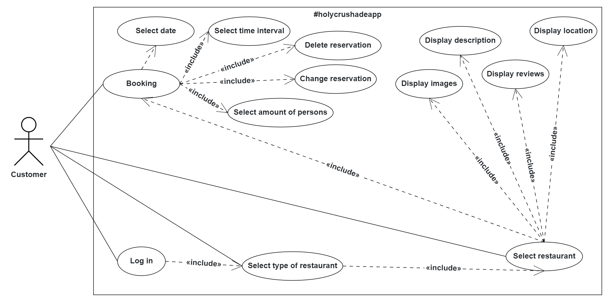
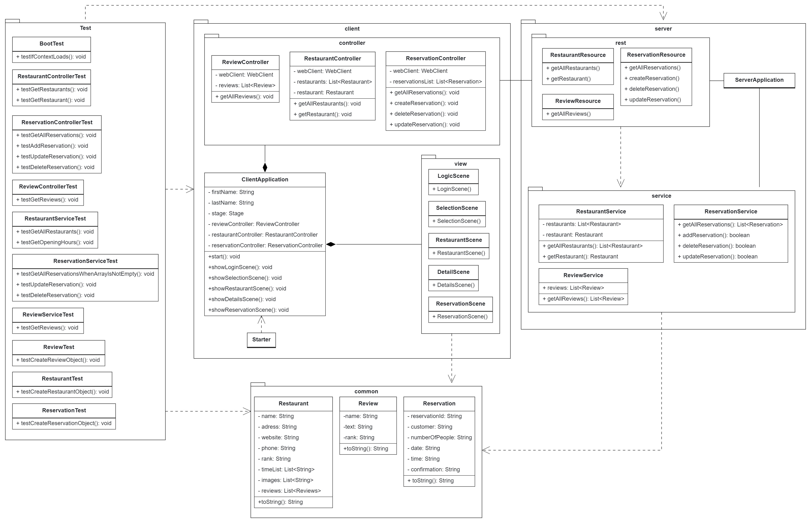
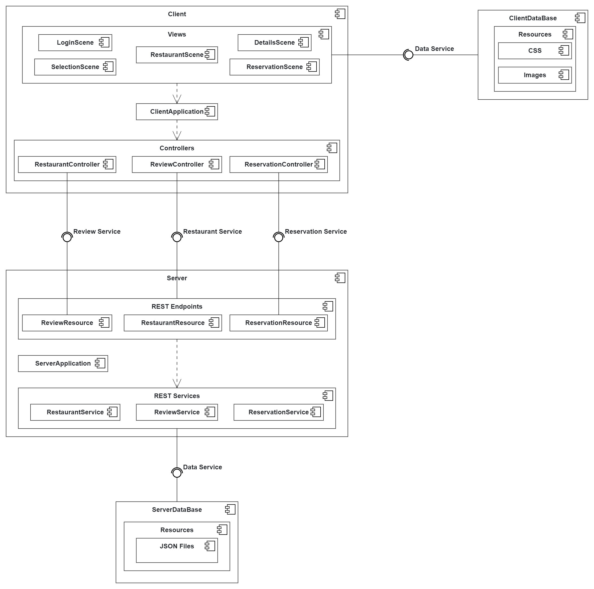

# Restaurant Advisor

- It is important to mention that this application was created for educational purposes.<
- Restaurants information was previously taken from Yelp.
- Application uses free icons from <a href=https://www.flaticon.com>Flaticon</a>.

## Subject

This application is used to browse the different types of the restaurants in Munich. It displays restaurant's detailed
information such as: location, opening hours, reviews and so on. It can be modified to cover different areas and scopes.

## Dependencies

- Open JDK 17
- Spring Framework 3.1.0
- JavaFX 19.0.2.1
- Jackson 2.14.2

## Problems
- Some project requirements were not met due to time restrictions, but the source code can be improved to implement all of them. 
- Web scraping is not complicated, because the html document of the Yelp website contained json with required data inside of it, and it could be 
easily extracted.
- Booking of the table in the restaurants is not implemented.

## How to launch the project?
First variant:
- Run: <b>./gradlew clean build</b>
- Run the server application: <b>gradle :Server:run</b> or <b>./gradlew :Server:run</b>
- Run the client application: <b>gradle :Client:run</b> or <b>./gradlew :Client:run</b>

Second variant:
- Run: <b>./gradlew clean build</b>
- Run the server application: <b>java -jar ./Server/builds/libs/jarFileName.jar</b>
- Run the client application: <b>java -jar ./Client/builds/libs/jarFileName.jar</b>

## UML Diagrams

#### Use Case Diagram

#### Class Diagram

#### Component Diagram

